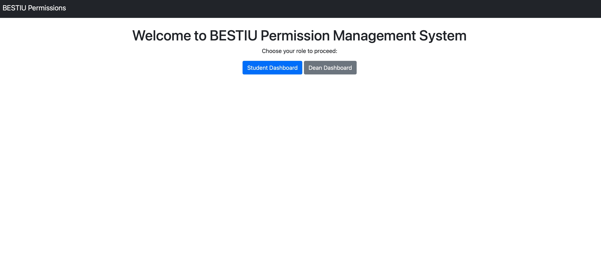
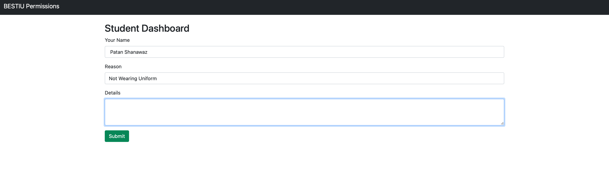
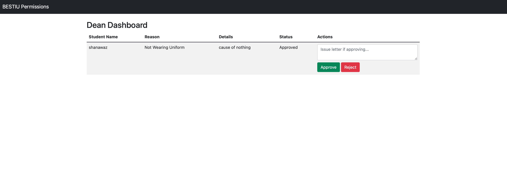

# College Permission System

A simple web application that manages permission letters for students and deans. Built with Python and Flask.

## 🚀 Features
- Students can request permission letters.
- Deans can approve/reject requests.
- Web-based UI built with Flask and Jinja templates.

## ⚡ Tech Stack
- **Backend**: Python, Flask  
- **Database**: SQLite  
- **Frontend**: HTML, CSS, JavaScript  

## 🛠 Installation Guide
1. Clone the repository:
   ```sh
   git clone https://github.com/patanshanawaz/college-permission-system.git
   cd college-permission-system/Backend

   pip install -r requirements.txt

   python app.py


## Screenshots

### Home Page


### Student Dashboard


### Dean Dashboard



   📌 About the Developer

Patan Shanawaz - B.Tech CSE with Cyber Security   | Passionate about Software Development and Cloud Securtiy, DevSecOps.
